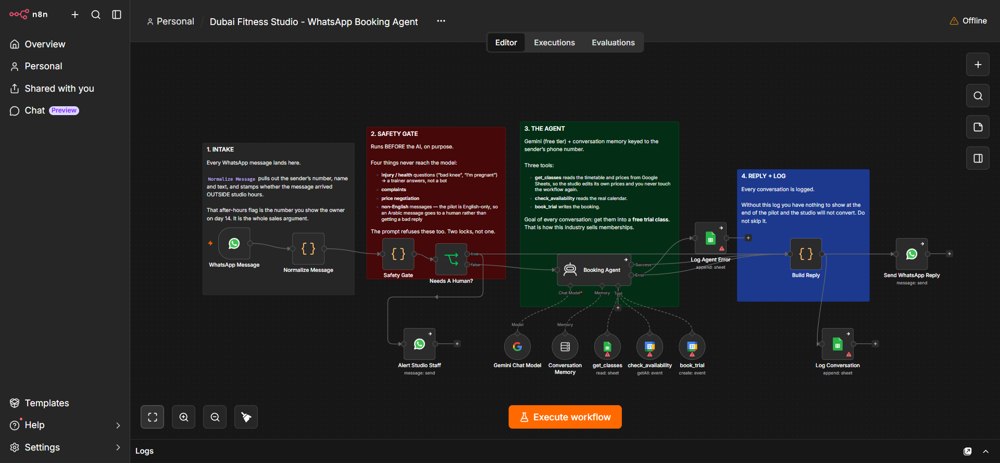

# WhatsApp AI Booking Agent

Books appointments over chat, 24/7.

A conversational agent on WhatsApp that understands incoming messages in any language, holds conversation state per customer, checks live Google Calendar availability, and walks them through service, date and time before creating the event. A dedicated error branch catches anything that breaks, alerting an admin and sending the customer a graceful fallback instead of silence.

**Category:** Conversational
**Status:** Live
**Tech:** n8n, Google Gemini, WhatsApp, Google Calendar, Gmail
**Impact:** ~4 hours/week saved, based on about 50 booking conversations a week at 5 minutes each, plus after-hours enquiries that used to go unanswered.
**Demo:** https://youtu.be/g1rPmKX-NtY

Built and run in n8n. This repo holds the writeup and a screenshot of the live canvas; the workflow JSON itself is kept private.

Part of a portfolio of n8n automation builds: https://faiyaz-rahman.vercel.app
